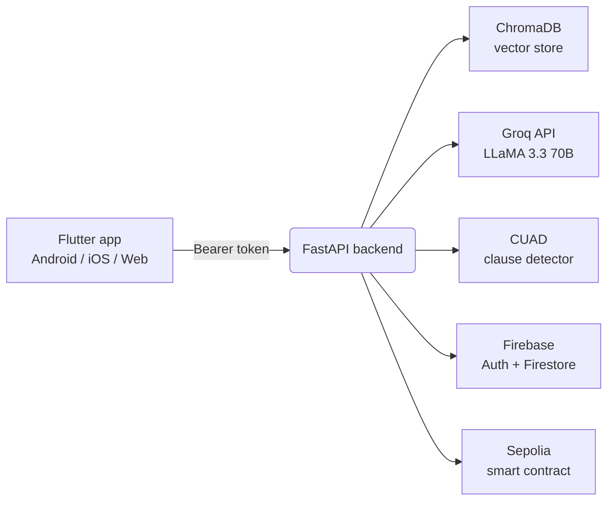

# LawScribe ⚖️

> AI-powered legal contract assistant — upload a contract, get plain-English summaries, automatic clause detection, RAG-grounded Q&A, and on-chain verification of every document hash.

LawScribe is a full-stack mobile app that helps non-lawyers understand legal contracts. Upload a PDF or DOCX, and within seconds you get a simple summary, a categorized list of clauses with risk indicators, and the ability to ask any question about your specific document. Every uploaded document's SHA-256 hash is also written to an Ethereum smart contract on Sepolia, giving you tamper-proof proof that the document existed at a specific point in time.

---

## ✨ Features

- 📄 **Upload PDF/DOCX contracts** straight from your phone
- 📝 **Plain-English summaries** of any legal document via Groq + LLaMA 3.3 70B
- 🔍 **Automatic clause detection** for 41 legal clause types using a CUAD-trained transformer
- 🟢🟡🔴 **Layman-friendly clause output** — grouped by category (key details, money, risk, restrictions, exit, legal) with color-coded risk dots
- 💬 **RAG-grounded Q&A** — ask anything about your contract, answers come straight from your document's text
- 💡 **AI insights** — for each detected clause, an explanation of what it means and why it matters, grounded in the actual contract wording
- 🔗 **Blockchain verification** — SHA-256 of every upload is logged on-chain (Ethereum Sepolia testnet)
- 🔐 **Firebase authentication** — secure per-user accounts with Firestore-backed dashboard
- 🌗 **Light & dark themes** with persisted preference
- 📊 **Dashboard** with user activity, recent documents, and weekly usage stats

---

## 🧱 Architecture



The Flutter client only ever talks to the FastAPI backend. The backend orchestrates the AI pipeline (extract → clean → chunk → embed → query), writes user activity to Firestore, and submits document hashes to the smart contract.

---

## 🛠 Tech stack

| Layer | Tech |
|---|---|
| **Mobile / Frontend** | Flutter, Firebase Auth, Cloud Firestore |
| **Backend** | FastAPI, Uvicorn, Python 3.11+ |
| **NLP / AI** | HuggingFace Transformers (CUAD), sentence-transformers, ChromaDB, Groq (LLaMA 3.3 70B Versatile) |
| **PDF / DOCX parsing** | PyMuPDF, python-docx, pypdf |
| **Auth** | Firebase Admin SDK (server) + Firebase Auth (client) |
| **Blockchain** | web3.py, Ethereum Sepolia testnet, custom Solidity contract |
| **Tunneling for dev** | Cloudflare Tunnel |

---

## 🚀 Quick start

### Prerequisites

- **Python 3.11+** (3.13 works but if `pip install` complains, fall back to 3.11 or 3.12)
- **Flutter 3.10+**
- A **Firebase project** with Authentication + Cloud Firestore enabled
- A **Groq API key** ([free at console.groq.com](https://console.groq.com/keys))
- *(Optional)* An **Alchemy or Infura Sepolia RPC URL** + a funded testnet wallet, for on-chain logging

### 1. Clone the repo

```bash
git clone https://github.com/aamnamazhar/LawScribe.git
cd LawScribe
```

### 2. Backend setup

```powershell
cd backend

# Create and activate a virtualenv
python -m venv .venv
.\.venv\Scripts\Activate.ps1                # Windows PowerShell
# source .venv/bin/activate                 # macOS / Linux

# Install dependencies (first install takes a while — torch is ~800 MB)
pip install -r requirements.txt

# Configure environment
cp .env.example .env
# then open .env and fill in your real keys
```

You also need `firebase-service-account.json` in the `backend/` directory. Download it from your Firebase project's **Project Settings → Service Accounts → Generate new private key**.

You'll also need the trained clause-detection model under `AI/clause_model/` — see [AI model](#-ai-model) below.

Then start the backend:

```powershell
python run.py
```

You should see:
```
Loading clause detection model...
Model loaded!
Loading embedding model...
Embedding model loaded!
INFO:     Uvicorn running on http://0.0.0.0:8000
INFO:     Application startup complete.
```

Test it from another terminal:
```bash
curl http://localhost:8000/health
# {"status":"ok"}
```

Or open http://localhost:8000/docs for the interactive FastAPI Swagger UI.

### 3. Flutter app setup

```powershell
cd my_app-main
flutter pub get
```

You'll need your own `google-services.json` (Android) and Firebase iOS config if you're targeting iOS — generate them via [FlutterFire CLI](https://firebase.flutter.dev/docs/cli/) pointed at your Firebase project.

Then run:

```powershell
# Android emulator (default — uses 10.0.2.2 as the host alias)
flutter run

# Real Android phone on the same WiFi as your laptop
flutter run --dart-define=BACKEND_URL=http://192.168.1.42:8000

# Real phone anywhere (cellular, university WiFi) — needs Cloudflare Tunnel
flutter run --dart-define=BACKEND_URL=https://your-tunnel.trycloudflare.com
```

### 4. Remote access via Cloudflare Tunnel (optional)

When your phone isn't on the same network as your laptop, use Cloudflare Tunnel to expose the backend over the internet without deploying anything.

```powershell
# Install once
winget install --id Cloudflare.cloudflared

# Start the tunnel (leave running in its own terminal)
cloudflared tunnel --url http://localhost:8000
```

It prints a URL like `https://random-words-1234.trycloudflare.com`. Pass that URL to Flutter via `--dart-define=BACKEND_URL=...`. Free, no account needed, but the URL changes each time you restart `cloudflared`.

---

## 🔐 Environment variables

Copy `backend/.env.example` to `backend/.env` and fill in:

| Variable | Required | Description |
|---|:---:|---|
| `GROQ_API_KEY` | ✅ | Groq API key for LLM inference |
| `FIREBASE_STORAGE_BUCKET` | optional | Firebase Storage bucket name (defaults to `c121890.appspot.com`) |
| `FIREBASE_CREDENTIALS` | optional | Absolute path to service account JSON (defaults to `backend/firebase-service-account.json`) |
| `BLOCKCHAIN_RPC_URL` | optional | Sepolia RPC URL (Alchemy / Infura). Leave blank to disable blockchain logging. |
| `CONTRACT_ADDRESS` | optional | Deployed smart contract address |
| `BLOCKCHAIN_PRIVATE_KEY` | optional | Wallet private key for on-chain writes (needs Sepolia ETH for gas) |
| `CORS_ALLOWED_ORIGINS` | optional | Comma-separated list of allowed Flutter web origins. Leave blank for dev. |
| `MAX_UPLOAD_BYTES` | optional | Max upload size in bytes (default 50 MB) |
| `USE_FIREBASE_STORAGE` | optional | Set to `true` to also upload PDFs to Firebase Storage (default: local-only) |

The Flutter app reads its backend URL from a build-time `--dart-define`:

```bash
flutter run --dart-define=BACKEND_URL=https://your-backend-url.com
```

If unset, it defaults to `http://10.0.2.2:8000` (Android emulator's alias for the host machine's localhost).

---

## 📁 Project structure

```
LawScribe/
├── AI/                              # Standalone Python ML pipeline (imported by backend)
│   ├── extract.py                   # PDF/DOCX text extraction
│   ├── preprocess.py                # Cleaning + chunking
│   ├── clause_detector.py           # CUAD transformer for 41 clause types
│   ├── rag.py                       # ChromaDB indexing + Groq Q&A + insights
│   ├── clause_model/                # Trained model (~419 MB, downloaded separately)
│   ├── vectorstore/                 # ChromaDB persistent store (auto-created)
│   └── requirements.txt
│
├── backend/                         # FastAPI server
│   ├── app/
│   │   ├── routes/                  # /documents, /ai, /health, /extraction
│   │   ├── services/                # Business logic + AI pipeline glue
│   │   │   ├── ai_service.py        # Orchestrates clause detection + RAG
│   │   │   ├── document_service.py  # File upload + hashing + storage
│   │   │   ├── firestore_service.py # Per-user activity + dashboard data
│   │   │   ├── blockchain_service.py# On-chain document hash logging
│   │   │   └── extraction_service.py
│   │   ├── core/firebase.py         # Firebase Admin init
│   │   ├── utils/                   # Auth helpers, hashing
│   │   └── main.py                  # FastAPI app + CORS + router wiring
│   ├── uploads/                     # Local PDF storage (auto-created)
│   ├── requirements.txt
│   ├── run.py                       # uvicorn entrypoint
│   └── .env.example
│
├── my_app-main/                     # Flutter client
│   ├── lib/
│   │   ├── screens/                 # chat, dashboard, settings, login, signup, splash
│   │   ├── components/              # ChatBubble, ScribeLogo, MessageInput, etc.
│   │   ├── services/api_service.dart# Backend HTTP client
│   │   ├── theme_provider.dart      # Light/dark theme + color helpers
│   │   ├── firebase_options.dart
│   │   └── main.dart
│   ├── android/, ios/, web/, ...    # Platform scaffolding
│   ├── assets/                      # App icons, images
│   └── pubspec.yaml
│
├── .gitignore                       # Excludes secrets, models, venvs, build artifacts
└── README.md
```

---

## 🌐 API endpoints

All `/ai/*` and `/documents/*` endpoints require a `Authorization: Bearer <Firebase ID token>` header.

| Method | Endpoint | Description |
|---|---|---|
| `GET` | `/health` | Healthcheck (no auth) |
| `POST` | `/documents/upload` | Upload a PDF/DOCX, indexes it for RAG, logs hash on-chain |
| `GET` | `/ai/summary?doc_id=<hash>` | Plain-English summary of a previously uploaded document |
| `POST` | `/ai/query` | RAG Q&A — ask any question about a document. Body: `{doc_id, question}` |
| `POST` | `/ai/clauses` | Detect legal clauses. Body: `{doc_id}` |
| `POST` | `/ai/insights` | Per-clause RAG-grounded explanations. Body: `{doc_id}` |
| `GET` | `/ai/verify?doc_id=<id>&file_hash=<hash>` | Verify a document hash on-chain |

Interactive API docs are available at `http://localhost:8000/docs` when the backend is running.

---

## 🧠 AI model

The clause-detection model is a fine-tuned transformer trained on the [CUAD](https://www.atticusprojectai.org/cuad) (Contract Understanding Atticus Dataset) — 41 legal clause types covering everything from termination and liability to non-compete and IP ownership.

The model files (~419 MB) are **not committed to this repo** (GitHub's file size limits). You need to obtain them separately and place them under `AI/clause_model/` before running the backend.

---

## 🧪 How it works

### Document indexing
1. Flutter uploads a PDF/DOCX to `POST /documents/upload`
2. Backend extracts text via PyMuPDF or python-docx, cleans it, splits into ~500-word overlapping chunks
3. Each chunk is embedded with `all-MiniLM-L6-v2` and stored in ChromaDB under a per-document collection
4. SHA-256 of the file is computed and submitted to the Sepolia smart contract via web3.py
5. File metadata is written to Firestore for the dashboard

### Clause detection
1. The cleaned text is split into overlapping character windows (1500 chars)
2. For each window, all 41 CUAD clause types are scored in a single batched forward pass through the transformer
3. Results are deduped (highest confidence per clause type wins)
4. The Flutter client groups them into 6 categories with risk-level dots (🟢/🟡/🔴) and plain-English explanations

### RAG Q&A
1. User question is embedded with the same model
2. Top-3 most similar chunks are retrieved from ChromaDB
3. Question + retrieved chunks are sent to Groq's LLaMA 3.3 70B with a strict prompt: "answer ONLY from this context"
4. Response streams back to the chat

### Per-clause insights
For each detected clause, the backend retrieves the most relevant excerpts from the document via vector similarity, then asks Groq to explain what that clause actually means in *this* contract — grounded in the real wording, not generic boilerplate.

---

## ⚠️ Known limitations

- **Chat history is in-memory only** — closing the app loses your current conversation. Persisting to Firestore is on the roadmap.
- **Single-document chats** — the chat screen tracks one active document at a time. Multi-document threads aren't implemented yet.
- **Cross-chat search** is a placeholder (the Settings button shows an explanation dialog).
- **Privacy Policy** dialog contains placeholder text — replace with your real policy before shipping publicly.
- **English contracts only** — the CUAD model is English-only.
- **Backend must be running** — no cloud deployment yet, you need either your laptop on the same network or a Cloudflare Tunnel.
- **Sepolia testnet only** — blockchain logging uses Sepolia (free testnet). Switching to mainnet requires updating `BLOCKCHAIN_RPC_URL` and funding the wallet with real ETH.

---

## 🗺 Roadmap

- [ ] Persist chat history to Firestore
- [ ] Multi-document chat threads with sidebar
- [ ] Real cross-chat search
- [ ] Cloud deployment (Hugging Face Spaces or Fly.io for the backend + model)
- [ ] In-app blockchain verification badge with tap-to-open Etherscan
- [ ] Export contract analysis as PDF
- [ ] Multi-language support

---

## 🤝 Contributing

This is currently a personal project. If you'd like to contribute, open an issue first to discuss what you'd like to change.

---

## 📄 License

Private project — all rights reserved. License will be added when/if this is open-sourced.

---

## 🙏 Acknowledgments

- [CUAD dataset](https://www.atticusprojectai.org/cuad) by The Atticus Project
- [Groq](https://groq.com/) for fast LLaMA 3.3 inference
- [HuggingFace Transformers](https://huggingface.co/docs/transformers) and [sentence-transformers](https://www.sbert.net/)
- [ChromaDB](https://www.trychroma.com/) for the vector store
- [Flutter](https://flutter.dev/), [FastAPI](https://fastapi.tiangolo.com/), [Firebase](https://firebase.google.com/)